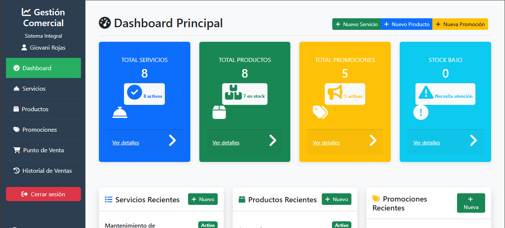
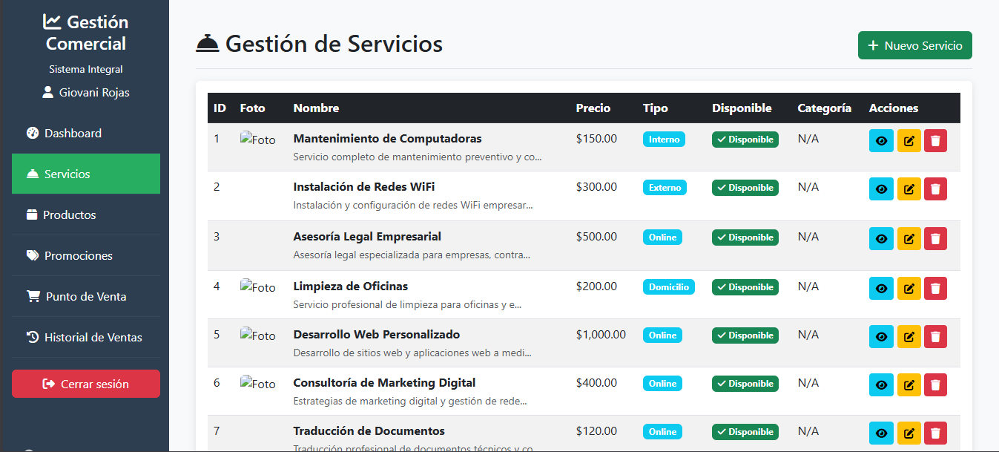
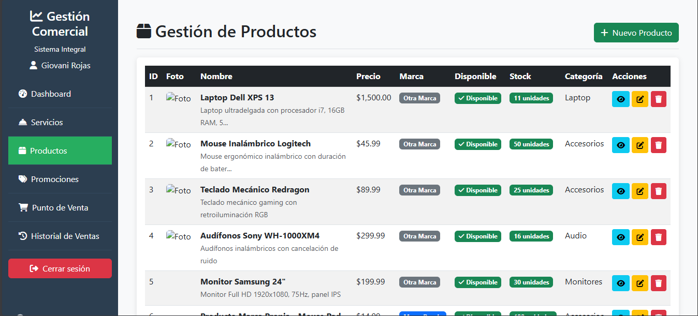
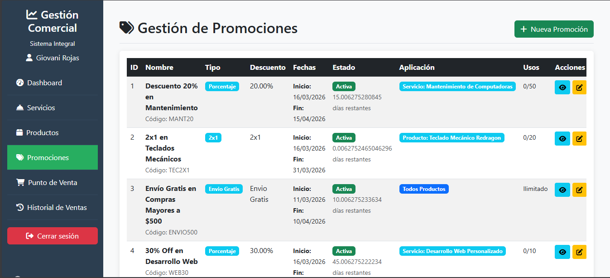

# 🚀 Sistema de Gestión Comercial - Laravel


---

## 🎥 Demo / Capturas

> 📸 **Screenshots / GIFs del sistema**






---

## 📑 Tabla de Contenidos

* [Características](#-características-principales)
* [Tecnologías](#-stack-tecnológico)
* [Instalación](#-instalación-local)
* [Configuración](#️-configuración-del-sistema)
* [Uso](#-guía-de-uso)
* [API](#-endpoints-api)
* [Estructura](#-estructura-de-archivos)
* [Base de Datos](#-esquema-de-base-de-datos)
* [Testing](#-testing-y-calidad)
* [Despliegue](#-despliegue-en-producción)
* [Seguridad](#-mejores-prácticas-de-seguridad)
* [Contribución](#-guía-de-contribución)
* [Licencia](#-licencia)
* [Contacto](#-contacto-y-soporte)

---

## ✨ Características Principales

### 🛠️ Módulos del Sistema

* ✅ **Gestión de Servicios** (Interno, Externo, Domicilio, Online)
* ✅ **Control de Productos** con inventario, stock y marcas
* ✅ **Sistema de Promociones** con reglas y fechas
* ✅ **Dashboard Avanzado** con métricas en tiempo real
* ✅ **Reportes Exportables** (PDF / Excel)
* ✅ **Página Pública** tipo catálogo
* ✅ **Gestión de Usuarios** con roles y permisos

### 🎨 Interfaz de Usuario

* Bootstrap 5 moderno y responsive
* Checkboxes interactivos de estado
* Subida de imágenes con vista previa
* Tablas con búsqueda y paginación
* Notificaciones y modales
* Validación de formularios en tiempo real

---

## 🛠️ Stack Tecnológico

### Backend

* **Laravel 10**
* **PHP 8.1+**
* **MySQL 8.0**
* **Eloquent ORM**
* **Blade**
* **Laravel DomPDF**

### Frontend

* **Bootstrap 5.3**
* **FontAwesome 6**
* **JavaScript Vanilla**
* **CSS3**

### Herramientas

* Composer
* NPM
* Git
* PHPUnit

---

## 🚀 Instalación Local

### Requisitos

* PHP >= 8.1
* Composer
* MySQL 8.0
* Node.js 18+
* Git

### Pasos

```bash
git clone https://github.com/Gio0938/gestion-comercial.git
cd gestion-comercial
composer install
npm install
npm run build
cp .env.example .env
php artisan key:generate
php artisan migrate --seed
php artisan storage:link
php artisan serve
```

📍 Acceso: `http://localhost:8000`

👤 **Admin demo**

* Email: [admin@empresa.com](mailto:admin@empresa.com)
* Password: password

---

## ⚙️ Configuración del Sistema

```env
APP_NAME="Gestión Comercial"
APP_ENV=local
APP_DEBUG=true
APP_URL=http://localhost:8000

DB_CONNECTION=mysql
DB_HOST=127.0.0.1
DB_PORT=3306
DB_DATABASE=gestion_comercial
DB_USERNAME=root
DB_PASSWORD=

FILESYSTEM_DISK=public
```

```bash
mkdir -p storage/app/public/{servicios,productos,usuarios}
chmod -R 775 storage bootstrap/cache
```

---

## 📚 Guía de Uso

### Panel Admin

1. Login
2. Dashboard
3. Servicios
4. Productos
5. Promociones
6. Reportes

### Roles

* **Admin**: acceso total
* **Empleado**: gestión limitada
* **Cliente**: solo catálogo

---

## 📁 Estructura de Archivos

```text
gestion-comercial/
├── app/
│   ├── Http/Controllers/
│   ├── Models/
├── database/
│   ├── migrations/
│   ├── seeders/
├── resources/
│   ├── views/
│   └── lang/
├── routes/
├── storage/
├── public/
└── tests/
```

### Ejemplo Modelo

```php
class Servicio extends Model
{
    protected $table = 'servicios';
    protected $primaryKey = 'idserv';

    public function promociones()
    {
        return $this->hasMany(Promocion::class);
    }
}
```

---

## 🗄️ Esquema de Base de Datos

```sql
CREATE TABLE servicios (
  idserv INT AUTO_INCREMENT PRIMARY KEY,
  nombre VARCHAR(255),
  precio DECIMAL(10,2),
  tipo_servicio ENUM('Interno','Externo','Domicilio','Online'),
  disponible BOOLEAN
);
```

Relaciones:

```
Servicios ──┐
            ├── Promociones
Productos ──┘
Usuarios ────┘
```

---

## 🔌 Endpoints API

```http
POST /api/login
GET  /api/servicios
POST /api/servicios
GET  /api/productos
```

---

## 🧪 Testing y Calidad

```bash
php artisan test
php artisan test --testsuite=Feature
```

---

## 🚀 Despliegue en Producción

* Ubuntu 22.04
* Nginx
* PHP-FPM 8.2
* MySQL 8
* Redis

```bash
php artisan config:cache
php artisan route:cache
php artisan view:cache
```

---

## 🔒 Mejores Prácticas de Seguridad

* Autenticación segura
* CSRF Protection
* Validaciones
* XSS / SQL Injection protection
* Rate limiting

---

## 🤝 Guía de Contribución

1. Fork
2. Feature branch
3. Commit
4. Pull Request

---

## 📄 Licencia

Licencia **MIT**

---

## 📞 Contacto y Soporte

* **Autor**: Gio0938
* **GitHub**: [https://github.com/Gio0938](https://github.com/Gio0938)
* **Email**: [tu-email@empresa.com](mailto:tu-email@empresa.com)

---

## 🙏 Agradecimientos

* Laravel Community
* Bootstrap Team
* Contribuidores

---

⭐ **Si este proyecto te fue útil, dale una estrella en GitHub**

[](https://star-history.com/#tu-usuario/gestion-comercial&Date)
